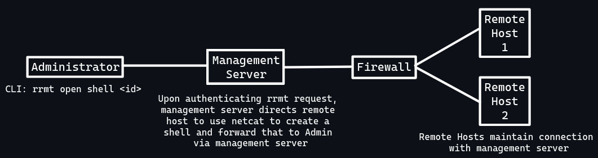

# Rust Reverse Shell System
My idea is a program you install on a target PC that will report 
to a server and an attacker can use the CLI to select which device 
they want to summon a shell on. 

See diagram:  

(P.S. I'm terrible with diagrams)
